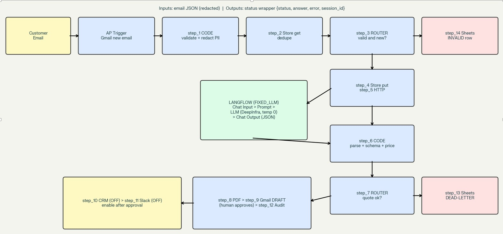

# Quote Pipeline: Email Request to Quote Draft

An automation that turns incoming quote-request emails into priced PDF drafts, built with Activepieces and Langflow (both open source).

## The problem
Sales teams re-type quote requests from email, price them by hand, and then notify colleagues. This workflow handles the repetitive part and leaves the final send to a person.

## How it works
1. A Gmail trigger picks up a new email.
2. The text is trimmed, personal data (emails, phone numbers) is masked, and a unique key is created from the message id.
3. Duplicates are skipped.
4. A language model extracts the request into strict JSON: customer, items, quantities.
5. A validation step checks the JSON schema and prices each item from a fixed price list. Prices never come from the model.
6. A PDF is generated and a Gmail draft is created for review.
7. Optional steps write to a CRM and notify a Slack channel. They are switched off by default.
8. Every run is logged to Google Sheets; anything invalid goes to a review sheet.

## Architecture


```
Gmail -> mask data -> dedupe -> Langflow extraction -> validate + price -> PDF -> Gmail draft
        invalid or duplicate -> review sheet        optional: CRM -> Slack -> audit log
```

## Design decisions
- Activepieces orchestrates; Langflow handles only the language step.
- A fixed LLM flow (no RAG, no agent) because the task is deterministic.
- Fail closed: invalid, duplicate, or unpriced requests go to review, never to a customer.
- No credentials in the files; connections and variables are configured per environment.

## Repository
- `activepieces/` workflow export (import into Activepieces)
- `langflow/` extraction flow (import into Langflow)
- `docs/` architecture image and project notes

## Setup
1. Import the Activepieces flow and connect Gmail and Google Sheets.
2. Import the Langflow flow and choose your model provider.
3. Set the Langflow URL, flow ID and API key in the HTTP step.
4. Fill in your price list and, if needed, the CRM and Slack steps.
5. Run a few test emails before turning the flow on.

## Scope
Demo project showing the pattern. It is adapted to each client's mailbox, price list and CRM.

## Copyright
Copyright (c) 2026 Muhammad Khir. All rights reserved. This repository is a portfolio sample; no license is granted for reuse.
